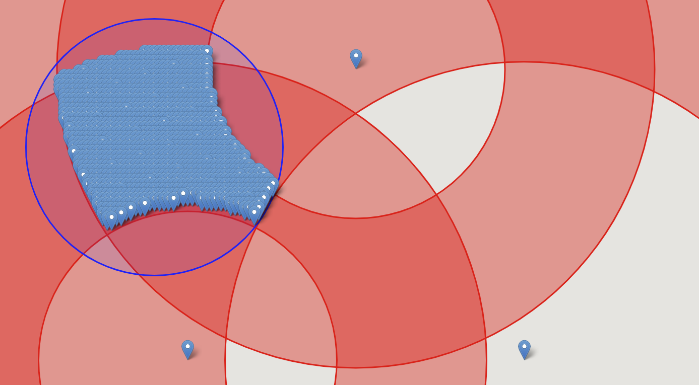

# bucket-trilateration

This is a node module for triangulating/trilaterating/multilaterating an object when you know how far it is from two or more beacons of known location *and* the distances are obfuscated into buckets eg. 0m-500m, 500m-1000m etc.

It could also be called annulus-trilateration, annuli-trilateration or torus-trilateration, but I've gone for bucket trilateration because torus is incorrect and annulus makes certain people snigger...

## usage

from your project dir

```npm install path/to/this/dir/bucket-trilateration```

then in your code

```
const utils = require('bucket-trilateration/utils')
const plot  = require('bucket-trilateration/plot')
const multilat = require('bucket-trilateration')

//define a search area
const boundsCenter = new utils.Point(45, 45)
const searchBounds = utils.BoundsFromCenter(boundsCenter, 10000)

//define buckets used to obfuscate the distance. these are determined by whatever service is returning the distance estimates
const obfuscationBuckets = [[0, 500],[500, 1000],[1000, 2000],[2000, 5000],[5000, 10000],[10000, 20000]]

//define some beacons
const beaconPoints = utils.generateTrianglePoints(boundsCenter, 1300)

//create the MultiLat Object
ml = new multilat.MultiLat(searchBounds, beaconPoints, obfuscationBuckets)

//get some actual distance buckets for your beacons
const beacons = [utils.BeaconFromPoint(beaconPoints[0], [1000,2000]), utils.BeaconFromPoint(beaconPoints[1], [1000,2000]), utils.BeaconFromPoint(beaconPoints[2], [1000,2000])]

//multilaterate!
centroid = ml.multilaterate(beacons)
```

see ```example.js``` for more

## algorithm details

This is a brute-force algorithm.  I've also played around with a non-linear optimization solution to this problem, but getting a reliable estimate of the error in the calculation is hard / impossible.  Here all we are doing is taking a grid of points and calculating how many of those points lie inside the annulus defined by every beacon.  Then we take all of the points we found and calculate the centroid and the error bounds (ie. the distance to the point in the intersection which is furthest from the centroid).  This gives us a circle inside which the object will definitely be found.

### null values

Sometimes, the algorithm will fail to find a particular point because the area in which all the beacon annuli overlap is so small that no points lie inside it.  This can be fixed by increasing the size of the grid (see example.js), but this means more points and slower performance.  You can use ```test-beacon-positions.js``` to test your chosen beacon distribution to see if it produces many null values and tweak your grid size.